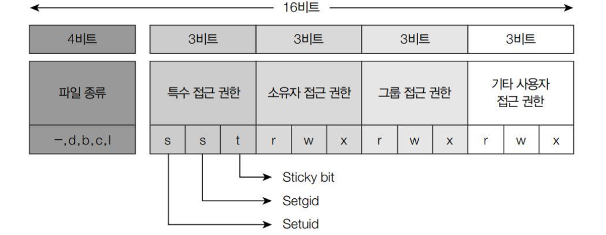

###### 서준이의 시프 정리 <br> 스스로 공부하려면 직접 정리하는 것이 좋습니다.

# 기본 개념 탑재 요망

## 파일 접근 권한 제어
+ 소유자 -> 파일 생성한 사용자, 당연히 권한 가장 많이 갖고 있고, 파일의 권한과 소유권 변경 가능
+ 그룹 -> 사용자의 집합, 속한 모든 사용자는 권한 공유
+ 기타 -> 진짜 기타

각각 소유자, 그룹, 기타에게 rwx 권한이 주어짐
> rwx -> 읽기(read), 쓰기(write), 실행(execute)

rwx외 추가로 설정할 수 있는 권한이 있는데 다음과 같음

> setuid, setgid, sticky bit
 
+ setuid -> 파일이 실행될 때 파일이 소유자의 권한으로 실행되도록 함
+ setgid -> 같은 맥락으로 파일의 그룹 소유권으로 실행되도록 함 
+ sticky bit -> 파일 소유자만 삭제할 수 있도록 하는 권한 (주로 디렉토리)

<hr>

## mode_t
32비트 환경 기준으로 unsigned int로 4바이트를 갖는다. <br>
하지만! 실제로는 16비트를 사용한다. <br>

mode_t는 파일 타입, 특수 권한, 접근 권한 총 3가지를 갖고 있다. <br>
<p align = center>
 </p>

|상수명|상숫값(8)|기능
|-|-|-|
|S_IFMT|170000|파일의 종류 비트를 가져오기 위한 비트 마스크
|S_IFSOCK|140000|소켓 파일
|S_IFLNK|120000|심벌릭 링크 파일
|S_IFREG|100000|일반 파일
|S_IFBLK|060000|블록 장치 특수 파일
|S_IFDIR|040000|디렉터리
|S_IFCHR|020000|문자 장치 특수 파일
|S_IFIFO|010000|FIFO 파일
|S_ISUID|004000|Set UID 권한
|S_ISGID|002000|Set GID 권한
|S_ISVTX|001000|Sticky Bit
|S_IRUSR|000400|소유자에게 읽기 권한|
|S_IWUSR|000200|소유자에게 쓰기 권한|
|S_IXUSR|000100|소유자에게 실행 권한|
|S_IRGRP|000040|그룹에게 읽기 권한|
|S_IWGRP|000020|그룹에게 쓰기 권한|
|S_IXGRP|000010|그룹에게 실행 권한|
|S_IROTH|000004|기타 사용자에게 읽기 권한|
|S_IWOTH|000002|기타 사용자에게 쓰기 권한|
|S_IXOTH|000001|기타 사용자에게 실행 권한|

이렇게 해서 총 16비트를 사용함 <br>
어떤 느낌인지 이제 감 옴? 그러면 외우자.

<hr>

### 파일의 종류 검색 (상수 flag)
|상수명|상숫값(8)|기능|
|-|-|-|
|S_IFMT|170000|파일의 종류 비트를 가져오기 위한 비트 마스크
|S_IFSOCK|140000|소켓 파일
|S_IFLNK|120000|심벌릭 링크 파일
|S_IFREG|100000|일반 파일
|S_IFBLK|060000|블록 장치 특수 파일
|S_IFDIR|040000|디렉터리
|S_IFCHR|020000|문자 장치 특수 파일
|S_IFIFO|010000|FIFO 파일


잘 보면 S_IF{유형}으로 플래그가 구성되어있음. <br>
000 00*1 111* | 000 000 000 000 <br>
8진수를 2진수로 변환해서 시각화하면 4개의 비트만 사용하고 있는걸 볼 수 있다.

statbuf 구조체의 st_mode 
``` c
int kind = statbuf.st_mode & S_IFMT; // <- 제일 중요
!assert_eq("S_IFDIR", kind);
````
S_IFMT AND 연산해주면 파일 종류 비트만 갖고 올 수 있음 <br>
ex) st_mode 값이 ```100644```일 경우, 파일 종류 부분으로 쓰이는 ```0170000```을 ```&``` 해줘서 파일 종류만 갖고 옴 <br>

근데 이러면 귀찮으니, 매크로를 사용해서 획기적으로 줄일 수 있음

<hr>

### 파일의 종류 검색 (매크로)
|매크로명|매크로 정의|기능|
|-|-|-|
|S_ISLNK(m)|(((m) & S_IFMT) == S_IFLNK)|참이면 심벌릭 링크
|S_ISREG(m)|(((m) & S_IFMT) == S_IFREG)|참이면 일반 파일
|S_ISDIR(m)|(((m) & S_IFMT) == S_IFDIR)|참이면 디렉터리 파일
|S_ISCHR(m)|(((m) & S_IFMT) == S_IFCHR)|참이면 문자 장치 특수 파일
|S_ISBLK(m)|(((m) & S_IFMT) == S_IFBLK)|참이면 블록 장치 특수 파일
|S_ISFIFO(m)|(((m) & S_IFMT) == S_IFFIFO)|참이면 FIFO 파일
|S_ISSOCK(m)|(((m) & S_IFMT) == S_IFSOCK)|참이면 소켓 파일

매크로는 S_IS{유형}으로 구성됨

복잡해보인다면 아래 예시를 보자.
```c
/* 매크로 미사용 버전 (값 비교) */
if((statbuf.st_mode & S_IFMT) == S_IFREG)
    puts("일반 파일!");

/* 매크로 사용 버전 */
if(S_ISREG(statbuf.st_mode))
    puts("일반 파일!");
```

<hr>

### 접근 권한 + 특수 권한  (상수 flag)
|상수명|상숫값(8)|기능
|-|-|-|
|S_ISUID|004000|Set UID 권한
|S_ISGID|002000|Set GID 권한
|S_ISVTX|001000|Sticky Bit
|S_IRUSR|000400|소유자에게 읽기 권한|
|S_IWUSR|000200|소유자에게 쓰기 권한|
|S_IXUSR|000100|소유자에게 실행 권한|
|S_IRGRP|000040|그룹에게 읽기 권한|
|S_IWGRP|000020|그룹에게 쓰기 권한|
|S_IXGRP|000010|그룹에게 실행 권한|
|S_IROTH|000004|기타 사용자에게 읽기 권한|
|S_IWOTH|000002|기타 사용자에게 쓰기 권한|
|S_IXOTH|000001|기타 사용자에게 실행 권한|

-> USR : 개인소유자 | GRP : 그룹사용자 | OTH : 기타 사용자 <br>
8진수이므로, RWX 순서대로 3bits씩 나누면 됨 <br>
> 000 000 000 <-> RWX(USR) | RWX(GRP) | RWX(OTH)