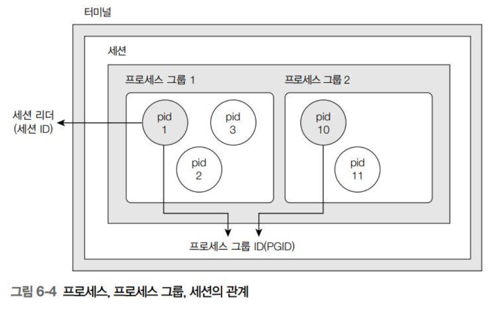

###### 이*준의 시프 정리 <br> 스스로 공부하려면 직접 정리하는 것이 좋습니다.

# Chapter 6
##  파일 제어 함수
|기능|함수|
|:-:|:-:|
| 메모리와 스왑 상태 | int sysinfo(struct sysinfo *info) |
| PID 검색 | pid_t getpid(void); |
| 부모 PID 검색 | pid_t getppid(void); |
| 프로세스 그룹 ID 검색 | pid_t getpgrp(void); |
| " | pid_t getpgid(pid_t pid); |
| 프로세스 그룹 ID 변경 | int setpgid(pid_t pid, pid_t, pgid); |
| 세션 리더 ID | pid_t getsid(pid_t pid); |
| 세션 생성 | pid_t setsid(void); |


# 프로세스 정리
## 프로세스 기본
프로세스 : 실행 중인 프로그램 의미<br>
프로세스는 당연히 text, data, heap, stack, empty area가 있다. (일반적인 스택 생각하셈)<br>

1. 프로세스는 사용자 모드에서 먼저 실행
2. 사용자 모드에서 시스템 호출 시 커널 모드로 전환
3. 커널 모드에서 더 이상 실행 없을 경우 수면 상태

+ 수면 상태 : 입출력이 끝나거나 다른 프로세스가 종료되기 기다릴 때
+ 실행대기 : 수면 상태에서 기다리다 이벤트 발생 시 

## 프로세스 그룹
+ 여러 프로세스 논리적으로 묶어 관리
+ 모든 프로세스는 그룹 구성원, **PGID**로 분류됨
+ 프로세스 실행시 부모 프로세스의 그룹에 속함. 
+ 세션 : 프로세스 그룹의 고유한 세션 **SID**로 구분


+ 리더 : 프로세스 그룹의 첫 그룹


## sysinfo 구조체
```c
struct sysinfo {
long uptime;    // 부팅 후 경과된 시간을 초 단위로 저장
unsigned long loads[3]; // 시스템 부하 평균을 저장하는 배열, 1, 5, 15분 계산
unsigned long totalram; // 사용 가능한 총 메모리 크기
unsigned long freeram; // 사용 가능한 메모리 크기
unsigned long sharedram; // 공유 메모리 크기
unsigned long bufferram; // 버퍼가 사용하는 메모리 크기 
unsigned long totalswap; // 스왑 영역 총 크기
unsigned long freeswap; // 사용 가능한 스왑 영역
unsigned short procs; // 현재 실행 중인 프로세스 수
unsigned long totalhigh; // 메모리 영역 총 크기
unsigned long freehigh; // 사용 가능한  사용자 메모리
unsigned int mem_unit; //메모리 크기를 바이트단위
char _f[20-2*sizeof(long)-sizeof(int)]; // 64비트 크기 패딩
};
```

일단 sysinfo로 구조체를 불러오고 거기에 대해서 프로세스 관련 함수를 사용한다.

### setpgid(pid_t pid, pid_t pgid);
pid를 입력된 pgid로 설정

특이점 
+ pid와 pgid가 같으면 pid가 그룹 리더가 됨
+ pid가 0이면 이 함수를 호출하는 현재 프로세스의 PID
+ pgid가 0이면 pid로 프로세스를 PGID 설정 (새로운 프로세스 그룹)

### getsid(pid_t pid);
세션 아이디 검색